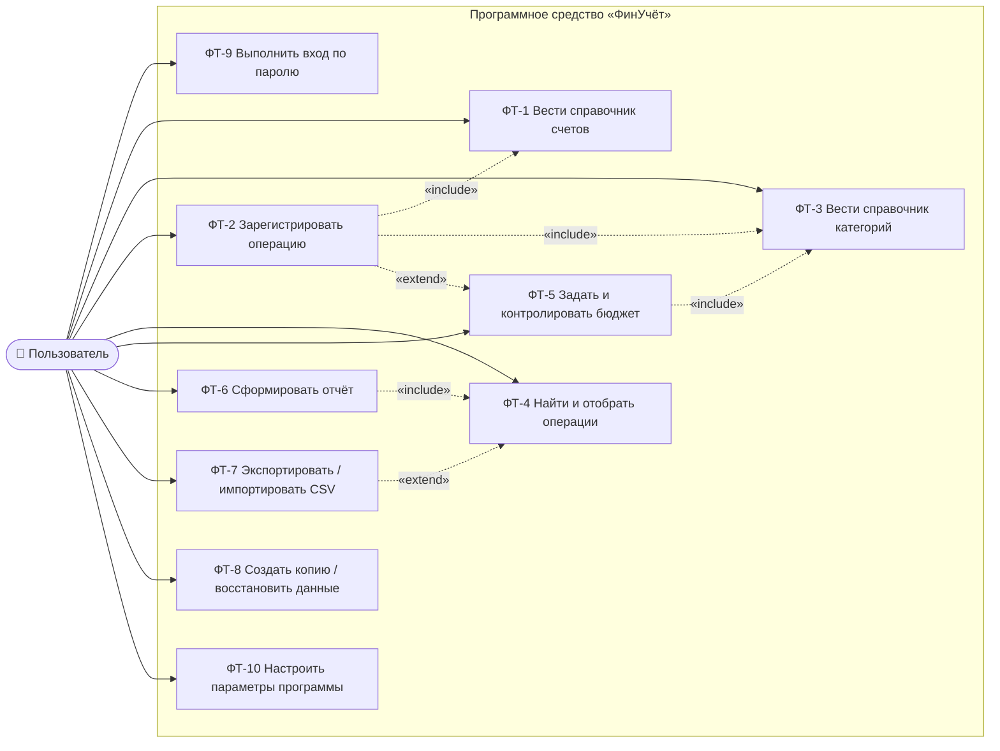

# Диаграмма вариантов использования

Документ: ФИНУЧЁТ.001-01 · Стадия: эскизный проект
Источник требований: [Техническое задание](../tz/FINUCHET.001-01-TZ.pdf), подраздел 4.1 (ФТ-1 — ФТ-10)

Диаграмма отражает функции, доступные единственному действующему лицу — **Пользователю**.
Программа работает в однопользовательском режиме, роль администратора не предусмотрена.

## Пояснения к связям

| Связь | Тип | Пояснение |
|---|---|---|
| ФТ-2 → ФТ-1 | include | Регистрация операции невозможна без выбора счёта |
| ФТ-2 → ФТ-3 | include | Доход и расход обязательно классифицируются категорией |
| ФТ-5 → ФТ-3 | include | Лимит задаётся для категории расходов |
| ФТ-6 → ФТ-4 | include | Отчёт строится по выборке операций за период |
| ФТ-7 → ФТ-4 | extend | Экспортируются операции, отобранные фильтром |
| ФТ-2 → ФТ-5 | extend | При достижении 80 % и 100 % лимита выводится предупреждение |

[← К списку диаграмм](README.md)
