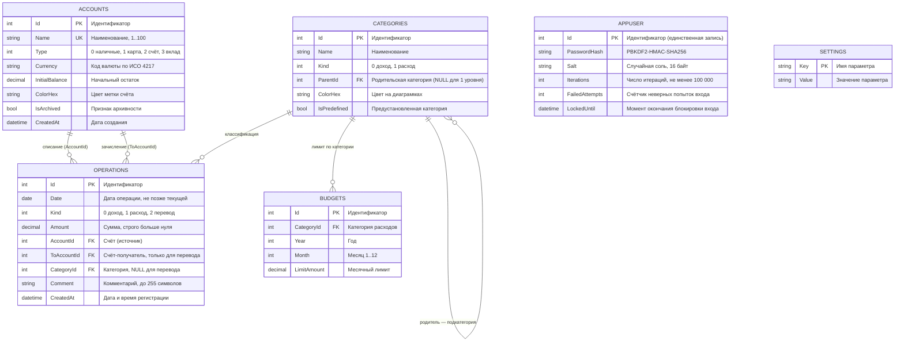

# Диаграмма «сущность — связь» (ER-диаграмма базы данных)

Документ: ФИНУЧЁТ.001-01 · Стадия: эскизный проект
СУБД: SQLite 3.x · ORM: Entity Framework Core 10 · Файл данных: `%LOCALAPPDATA%\FinUchet\finuchet.db`

## Ограничения целостности

| Ограничение | Реализация | Требование ТЗ |
|---|---|---|
| Уникальность наименования счёта | Уникальный индекс `Accounts.Name` | ФТ-1 |
| Запрет удаления счёта с операциями | `DeleteBehavior.Restrict` для `Operations.AccountId` | ФТ-1 |
| `Amount > 0` | `CHECK`-ограничение и проверка в слое служб | ФТ-2 |
| `Date <= CURRENT_DATE` | Проверка в слое служб | ФТ-2 |
| `AccountId <> ToAccountId` для перевода | `CHECK`-ограничение и проверка в слое служб | ФТ-2 |
| Иерархия категорий не глубже двух уровней | Проверка в слое служб (`ParentId.ParentId IS NULL`) | ФТ-3 |
| Уникальность лимита на месяц | Уникальный индекс `(CategoryId, Year, Month)` | ФТ-5 |
| Атомарность перевода | Одна транзакция БД на обе стороны перевода | п. 4.2.2 ТЗ |

Текущий остаток по счёту в базе данных не хранится: он вычисляется как
`InitialBalance + Σ(зачисления) − Σ(списания)`, что исключает рассогласование данных.

[← К списку диаграмм](README.md)
