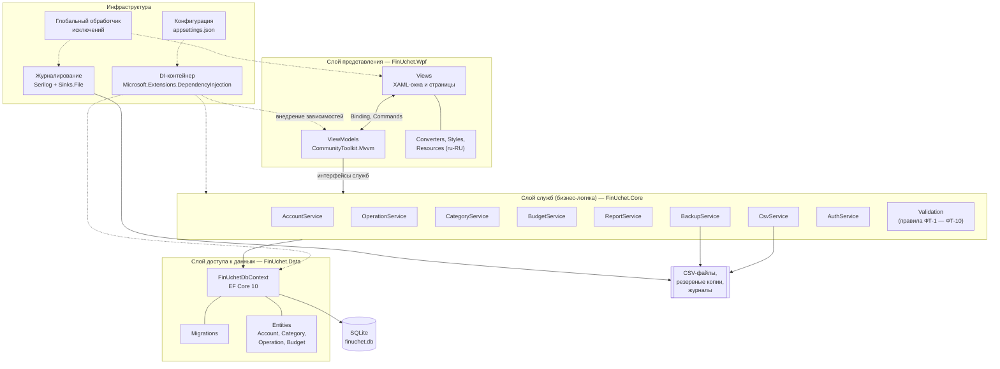

# Диаграмма архитектуры приложения

Документ: ФИНУЧЁТ.001-01 · Стадия: технический проект
Шаблон: MVVM (Model — View — ViewModel) · Требование ТЗ: п. 4.5.3

## Состав проектов решения

| Проект | Тип | Назначение |
|---|---|---|
| `FinUchet.Wpf` | WPF (net10.0-windows) | Окна, страницы, модели представления, ресурсы интерфейса |
| `FinUchet.Core` | Class library (net10.0) | Модели предметной области, службы бизнес-логики, правила контроля данных |
| `FinUchet.Data` | Class library (net10.0) | `DbContext`, конфигурации сущностей, миграции схемы БД |
| `FinUchet.Tests` | xUnit (net10.0) | Модульные и интеграционные тесты, покрытие бизнес-логики ≥ 70 % |

## Правила взаимодействия слоёв

- Слой представления не обращается к `DbContext` напрямую — только через интерфейсы служб.
- Службы не зависят от WPF и от типов `System.Windows`, что делает их пригодными для модульного тестирования.
- Все операции, затрагивающие более одной таблицы (в том числе перевод между счетами),
  выполняются в одной транзакции базы данных (п. 4.2.2 ТЗ).
- Необработанные исключения перехватываются глобальным обработчиком: пользователю выводится
  сообщение на русском языке, полные сведения записываются в журнал (п. 4.2.3 ТЗ).

[← К списку диаграмм](README.md)
