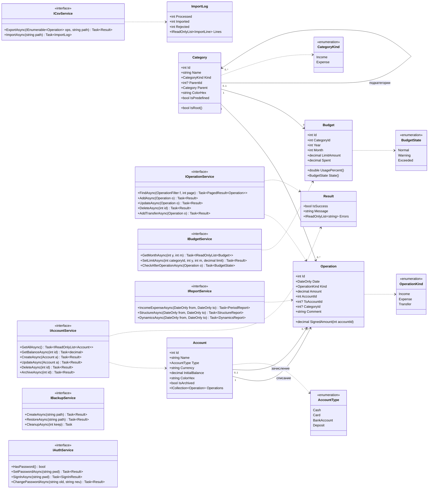

# Диаграмма классов моделей и служб

Документ: ФИНУЧЁТ.001-01 · Стадия: технический проект

## Примечания

- Все службы возвращают объект `Result` (или его обобщённую форму), содержащий признак успеха
  и перечень сообщений для пользователя, — это позволяет выводить тексты из раздела 4
  руководства пользователя без дублирования логики в слое представления.
- `Budget.State()` возвращает `Normal` (< 80 %), `Warning` (80…100 %) или `Exceeded` (> 100 %),
  что соответствует цветовой индикации, описанной в ФТ-5.
- Перечисления (`enum`) хранятся в базе данных как целые числа.

[← К списку диаграмм](README.md)
