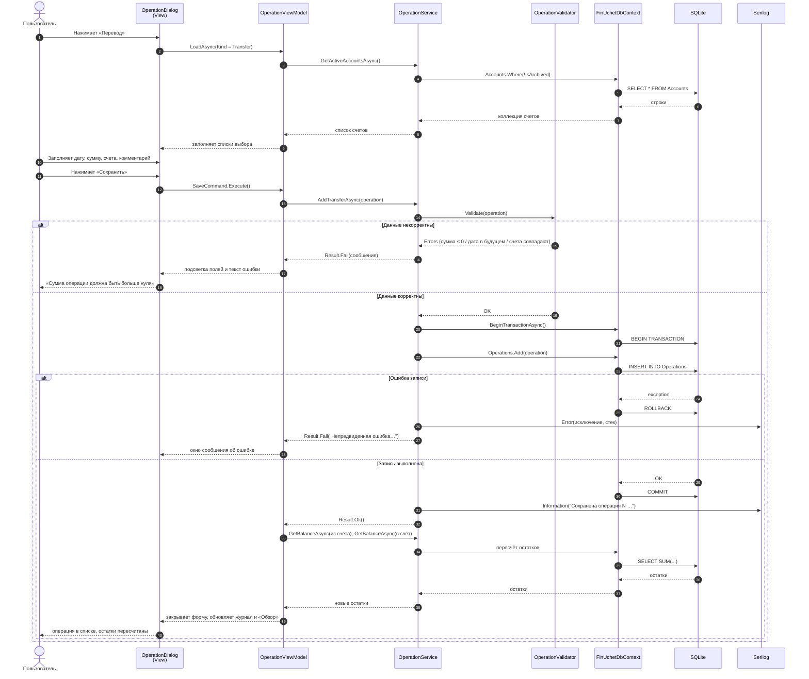

# Диаграмма последовательности: регистрация перевода между счетами

Документ: ФИНУЧЁТ.001-01 · Стадия: технический проект
Реализуемое требование: ФТ-2 (регистрация операций), п. 4.2.2 ТЗ (транзакционность)

## Ключевые свойства сценария

1. **Атомарность.** Перевод изменяет остатки двух счетов; запись выполняется в одной
   транзакции. При сбое посередине транзакция откатывается полностью, операция в базе
   не появляется, остатки обоих счетов остаются прежними.
2. **Контроль до записи.** Проверка данных выполняется в слое служб до открытия транзакции,
   поэтому ошибочный ввод не приводит к обращению к базе данных.
3. **Остатки не хранятся.** После фиксации транзакции остатки вычисляются запросом
   к таблице операций, а не обновляются отдельным полем, — рассогласование исключено.
4. **Журналирование.** Штатные события записываются с уровнем `INF`, ошибки — с уровнем `ERR`
   вместе с текстом исключения и стеком вызовов (п. 4.2.3 ТЗ).

[← К списку диаграмм](README.md)
