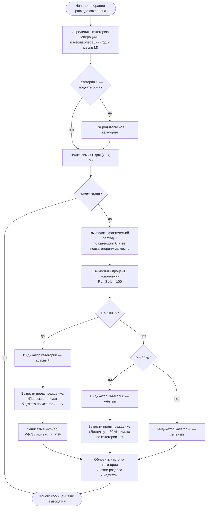

# Схема алгоритма: контроль исполнения бюджета

Документ: ФИНУЧЁТ.001-01 · Стадия: технический проект
Реализуемое требование: ФТ-5 (планирование и контроль бюджетов)

Алгоритм выполняется после успешного сохранения операции расхода.

## Соответствие требованию ФТ-5

| Условие | Цвет индикатора | Сообщение | Состояние `BudgetState` |
|---|---|---|---|
| `P < 80 %` | зелёный | не выводится | `Normal` |
| `80 % ≤ P ≤ 100 %` | жёлтый | «Достигнуто 80 % лимита по категории …» | `Warning` |
| `P > 100 %` | красный | «Превышен лимит бюджета по категории …» | `Exceeded` |

Предупреждения носят информационный характер: операция остаётся сохранённой,
решение о корректировке расходов или лимита принимает пользователь.
Расход по категории первого уровня включает расходы всех её подкатегорий.

[← К списку диаграмм](README.md)
