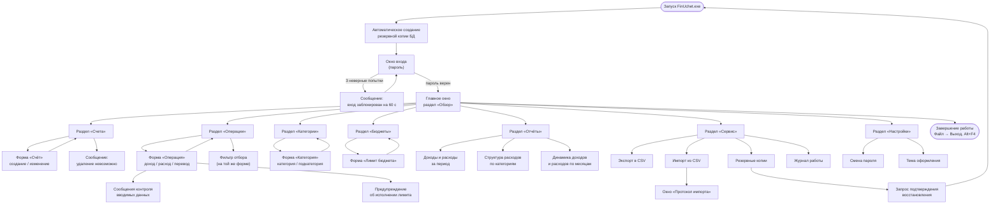

# Схема экранных форм и переходов

Документ: ФИНУЧЁТ.001-01 · Стадия: эскизный проект
Подробное описание форм — в [руководстве пользователя](../user-guide/README.md), раздел 3.

## Перечень экранных форм

| Форма | Раздел руководства | Снимок экрана |
|---|---|---|
| Окно входа | 3.2 | [01-login.png](../user-guide/images/01-login.png) |
| Главное окно, раздел «Обзор» | 3.3 | [02-main.png](../user-guide/images/02-main.png) |
| Раздел «Счета» | 3.4 | [03-accounts.png](../user-guide/images/03-accounts.png) |
| Форма «Счёт» | 3.4.1 | [04-account-dialog.png](../user-guide/images/04-account-dialog.png) |
| Раздел «Категории» | 3.5 | [06-categories.png](../user-guide/images/06-categories.png) |
| Раздел «Операции» | 3.6, 3.7 | [07-operations.png](../user-guide/images/07-operations.png) |
| Форма «Операция» (расход) | 3.6.1 | [08-operation-expense.png](../user-guide/images/08-operation-expense.png) |
| Форма «Операция» (перевод) | 3.6.2 | [09-operation-transfer.png](../user-guide/images/09-operation-transfer.png) |
| Раздел «Бюджеты» | 3.8 | [11-budgets.png](../user-guide/images/11-budgets.png) |
| Отчёт «Доходы и расходы за период» | 3.9 | [13-report-totals.png](../user-guide/images/13-report-totals.png) |
| Отчёт «Структура расходов» | 3.9 | [14-report-structure.png](../user-guide/images/14-report-structure.png) |
| Отчёт «Динамика по месяцам» | 3.9 | [15-report-dynamics.png](../user-guide/images/15-report-dynamics.png) |
| Раздел «Сервис» | 3.10, 3.11 | [16-service.png](../user-guide/images/16-service.png) |
| Окно «Протокол импорта» | 3.10.2 | [17-import-log.png](../user-guide/images/17-import-log.png) |
| Раздел «Настройки» | 3.12 | [19-settings.png](../user-guide/images/19-settings.png) |

[← К списку диаграмм](README.md)
