# Руководство пользователя «ФинУчёт»

**Обозначение документа:** ФИНУЧЁТ.001-01 34 · **Версия программы:** 1.0
**Стандарт:** ГОСТ 19.505-79 (ЕСПД. Руководство оператора), оформление по ГОСТ 19.106-78

> 📄 **Официальная версия документа для сдачи:**
> [FINUCHET.001-01-34-user-guide.docx](FINUCHET.001-01-34-user-guide.docx) — оформлена по ГОСТ 19.106-78
> (Times New Roman 14 пт, интервал 1,5, поля 30/15/20/20 мм, сквозная нумерация страниц).
> При первом открытии в Word или LibreOffice подтвердите обновление полей — содержание
> заполнится автоматически.
>
> Настоящая страница — то же руководство в формате Markdown для чтения на GitHub.

## Содержание

- [1 Назначение программы](#1-назначение-программы)
- [2 Условия выполнения программы](#2-условия-выполнения-программы)
- [3 Выполнение программы](#3-выполнение-программы)
  - [3.1 Установка](#31-установка-программы) · [3.2 Запуск и вход](#32-запуск-программы-и-вход)
    · [3.3 Главное окно](#33-главное-окно-программы)
  - [3.4 Счета](#34-ведение-справочника-счетов-фт-1) · [3.5 Категории](#35-ведение-справочника-категорий-фт-3)
    · [3.6 Операции](#36-регистрация-финансовых-операций-фт-2) · [3.7 Поиск и фильтрация](#37-поиск-и-фильтрация-операций-фт-4)
  - [3.8 Бюджеты](#38-планирование-и-контроль-бюджетов-фт-5) · [3.9 Отчёты](#39-формирование-отчётов-фт-6)
    · [3.10 Экспорт и импорт](#310-экспорт-и-импорт-данных-фт-7) · [3.11 Резервные копии](#311-резервное-копирование-и-восстановление-данных-фт-8)
    · [3.12 Настройки](#312-настройка-параметров-программы-фт-10) · [3.13 Завершение работы](#313-завершение-работы-программы)
- [4 Сообщения пользователю](#4-сообщения-пользователю)
- [Приложение А. Сочетания клавиш](#приложение-а-сочетания-клавиш)
- [Приложение Б. Структура файла обмена CSV](#приложение-б-структура-файла-обмена-csv)

---

## 1 Назначение программы

### 1.1 Функциональное назначение

Программное средство «ФинУчёт» предназначено для автоматизации учёта личных денежных средств
пользователя: хранения сведений о счетах и остатках на них, регистрации финансовых операций
(доход, расход, перевод между счетами), классификации операций по категориям, планирования
и контроля месячных бюджетов, формирования аналитической отчётности за произвольный период.

### 1.2 Эксплуатационное назначение

Программа эксплуатируется на персональном компьютере в однопользовательском режиме.
Все данные хранятся локально; передача сведений в сеть Интернет не выполняется.
Категория пользователей — физические лица, ведущие личный или семейный бюджет и владеющие
Windows на уровне уверенного пользователя. Время освоения по руководству — не более 1 часа.

### 1.3 Состав выполняемых функций

| Обозначение | Функция | Раздел |
|---|---|---|
| ФТ-1 | Ведение справочника счетов | [3.4](#34-ведение-справочника-счетов-фт-1) |
| ФТ-2 | Регистрация финансовых операций | [3.6](#36-регистрация-финансовых-операций-фт-2) |
| ФТ-3 | Ведение справочника категорий | [3.5](#35-ведение-справочника-категорий-фт-3) |
| ФТ-4 | Поиск и фильтрация операций | [3.7](#37-поиск-и-фильтрация-операций-фт-4) |
| ФТ-5 | Планирование и контроль бюджетов | [3.8](#38-планирование-и-контроль-бюджетов-фт-5) |
| ФТ-6 | Формирование отчётов | [3.9](#39-формирование-отчётов-фт-6) |
| ФТ-7 | Экспорт и импорт данных в формате CSV | [3.10](#310-экспорт-и-импорт-данных-фт-7) |
| ФТ-8 | Резервное копирование и восстановление | [3.11](#311-резервное-копирование-и-восстановление-данных-фт-8) |
| ФТ-9 | Разграничение доступа по паролю | [3.2](#32-запуск-программы-и-вход) |
| ФТ-10 | Настройка параметров приложения | [3.12](#312-настройка-параметров-программы-фт-10) |

### 1.4 Ограничения области применения

- работа одного пользователя; одновременный доступ к одному файлу базы данных не поддерживается;
- учёт ведётся в одной валюте, пересчёт по курсам не выполняется;
- программа не предназначена для бухгалтерского и налогового учёта организаций;
- подключение к банковским сервисам не выполняется — данные вводятся вручную или импортируются из CSV;
- гарантированное быстродействие обеспечивается при объёме базы до 50 000 операций.

---

## 2 Условия выполнения программы

### 2.1 Требования к техническим средствам

| Компонент | Минимально | Рекомендуется |
|---|---|---|
| Процессор | x64, 2 ядра, 1,8 ГГц | x64, 4 ядра, 2,4 ГГц |
| Оперативная память | 4 ГБ | 8 ГБ и более |
| Свободное место на накопителе | 500 МБ | 1 ГБ, SSD |
| Разрешение экрана | 1366 × 768 | 1920 × 1080 |
| Устройства ввода | Клавиатура и мышь | Клавиатура и мышь |

Подключение к сети Интернет не требуется — все функции доступны в автономном режиме.

### 2.2 Требования к программным средствам

| Наименование | Версия | Примечание |
|---|---|---|
| Microsoft Windows | 10 x64 (21H2 и выше) или 11 x64 | Иные ОС не поддерживаются |
| .NET Desktop Runtime | 10.0 | Не требуется для self-contained поставки |
| SQLite | 3.x | Входит в поставку |
| Microsoft Excel / LibreOffice Calc | — | Необязательно, для просмотра CSV |

### 2.3 Размещение файлов программы и данных

| Путь | Назначение |
|---|---|
| `FinUchet.exe` | Исполняемый файл программы |
| `appsettings.json` | Файл конфигурации приложения |
| `%LOCALAPPDATA%\FinUchet\finuchet.db` | Файл базы данных SQLite |
| `%LOCALAPPDATA%\FinUchet\backups\` | Резервные копии (5 последних) |
| `%LOCALAPPDATA%\FinUchet\logs\` | Журналы работы (14 суток) |
| `%LOCALAPPDATA%\FinUchet\settings.json` | Пользовательские настройки интерфейса |

---

## 3 Выполнение программы

### 3.1 Установка программы

1. Скопировать каталог с программой на локальный диск.
2. При использовании поставки, зависящей от среды выполнения, установить **.NET 10 Desktop Runtime**.
3. При необходимости создать ярлык `FinUchet.exe` на рабочем столе.

Права администратора не требуются. Удаление выполняется удалением каталога программы;
база данных, копии и журналы остаются в каталоге данных (см. 2.3).

### 3.2 Запуск программы и вход

При запуске автоматически создаётся резервная копия базы данных, после чего открывается окно входа.

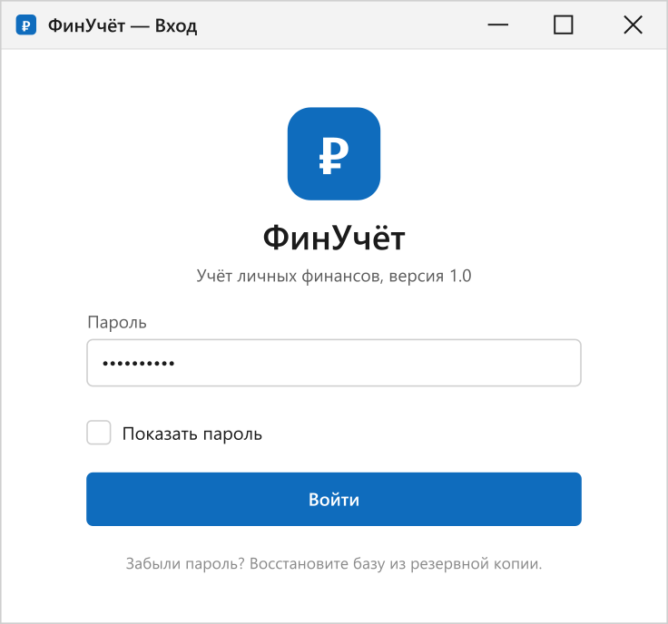
*Рисунок 1 — Окно входа в программу*

1. Ввести пароль в поле **«Пароль»** (для контроля ввода — флажок «Показать пароль»).
2. Нажать **«Войти»** или клавишу `Enter`.

**При первом запуске** окно работает в режиме задания пароля: пользователь вводит новый пароль
и подтверждает его. Пароль хранится только в виде хеша **PBKDF2-HMAC-SHA256** (100 000 итераций,
случайная соль 16 байт) и восстановлению не подлежит. Одновременно справочник категорий
заполняется набором из 24 предустановленных категорий.

После трёх неверных попыток вход блокируется на 60 секунд:

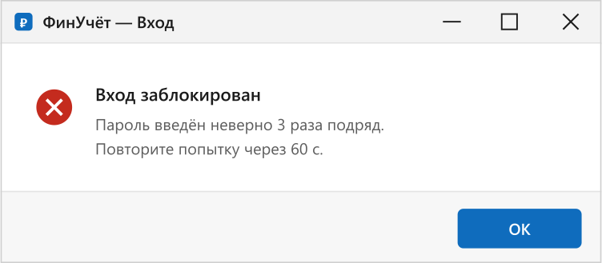
*Рисунок 2 — Сообщение о блокировке входа*

> ⚠️ Если пароль утрачен, доступ к данным восстанавливается только из резервной копии,
> созданной до изменения пароля (см. [3.11](#311-резервное-копирование-и-восстановление-данных-фт-8)).

### 3.3 Главное окно программы

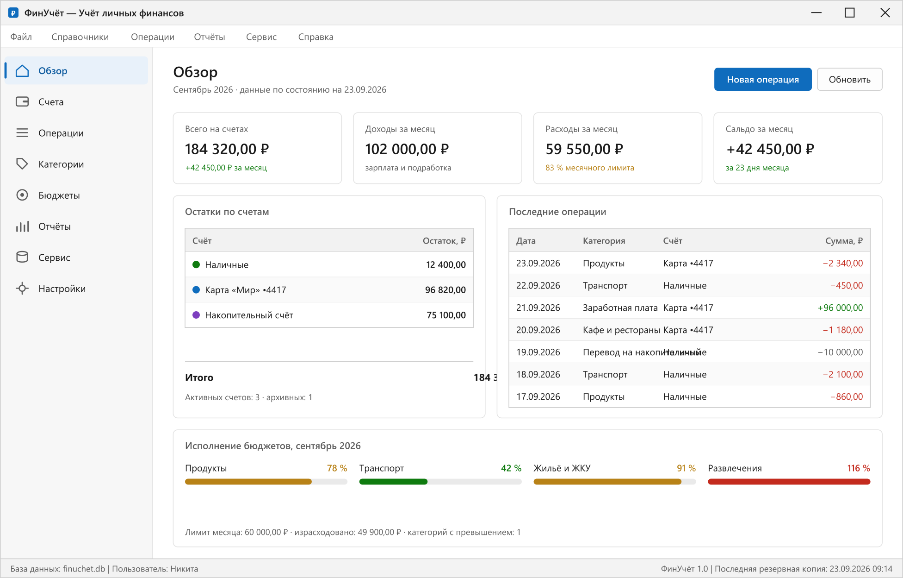
*Рисунок 3 — Главное окно программы, раздел «Обзор»*

| Элемент | Назначение |
|---|---|
| Строка меню | Доступ ко всем командам: «Файл», «Справочники», «Операции», «Отчёты», «Сервис», «Справка» |
| Панель навигации (слева) | Переключение между разделами программы |
| Плитки показателей | Остаток на счетах, доходы, расходы и сальдо текущего месяца |
| «Остатки по счетам» | Текущие остатки по активным счетам и итог |
| «Последние операции» | Семь последних зарегистрированных операций |
| «Исполнение бюджетов» | Индикаторы исполнения месячных лимитов |
| Строка состояния | Файл БД, пользователь, версия, время последней резервной копии |

### 3.4 Ведение справочника счетов (ФТ-1)

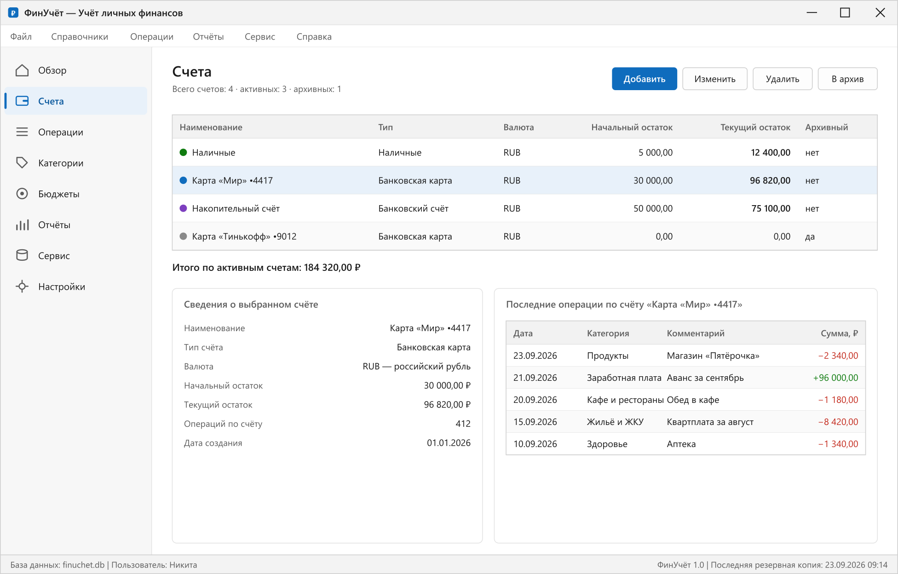
*Рисунок 4 — Раздел «Счета»*

Текущий остаток рассчитывается автоматически как сумма начального остатка и всех операций
по счёту. Программа поддерживает хранение не менее 50 счетов.

#### Создание счёта

1. Нажать **«Добавить»** — открывается форма «Счёт».
2. Заполнить поля формы.
3. Нажать **«Сохранить»**.

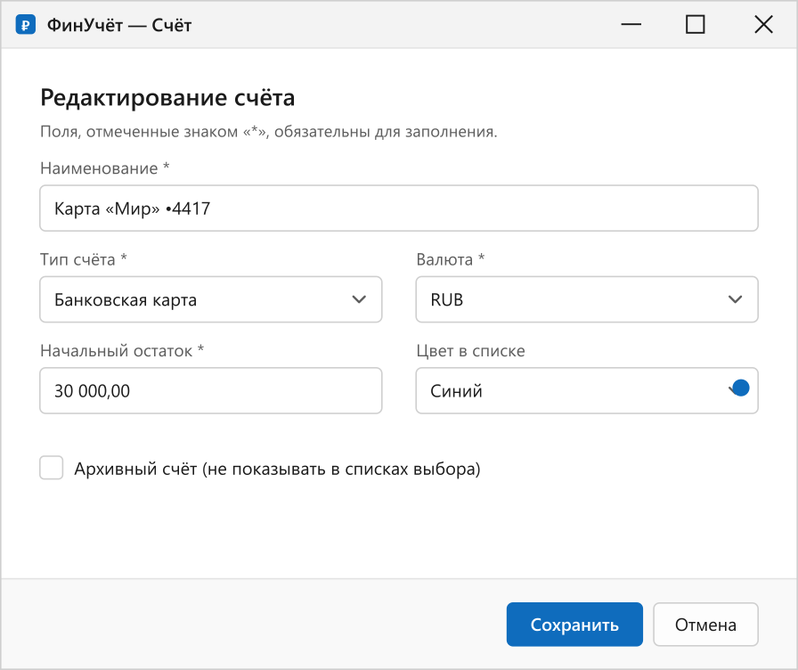
*Рисунок 5 — Форма «Счёт»*

| Поле | Обязательное | Правила заполнения |
|---|:--:|---|
| Наименование | да | 1…100 символов, должно быть уникальным |
| Тип счёта | да | «Наличные», «Банковская карта», «Банковский счёт», «Вклад» |
| Валюта | да | Код по ИСО 4217; по умолчанию — валюта из настроек |
| Начальный остаток | да | Число с двумя знаками после запятой |
| Цвет в списке | нет | Цвет метки счёта в таблицах |
| Архивный счёт | нет | Архивные счета не предлагаются при регистрации операций |

#### Изменение, архивирование и удаление

- **«Изменить»** (или двойной щелчок по строке) — правка счёта; изменение начального остатка
  пересчитывает текущий остаток.
- **«В архив»** — счёт сохраняется вместе с операциями, но исчезает из списков выбора.
- **«Удалить»** — удаление счёта, по которому есть операции, блокируется:

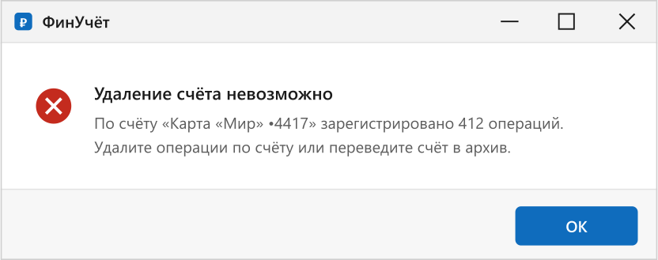
*Рисунок 6 — Сообщение об отказе в удалении счёта*

### 3.5 Ведение справочника категорий (ФТ-3)

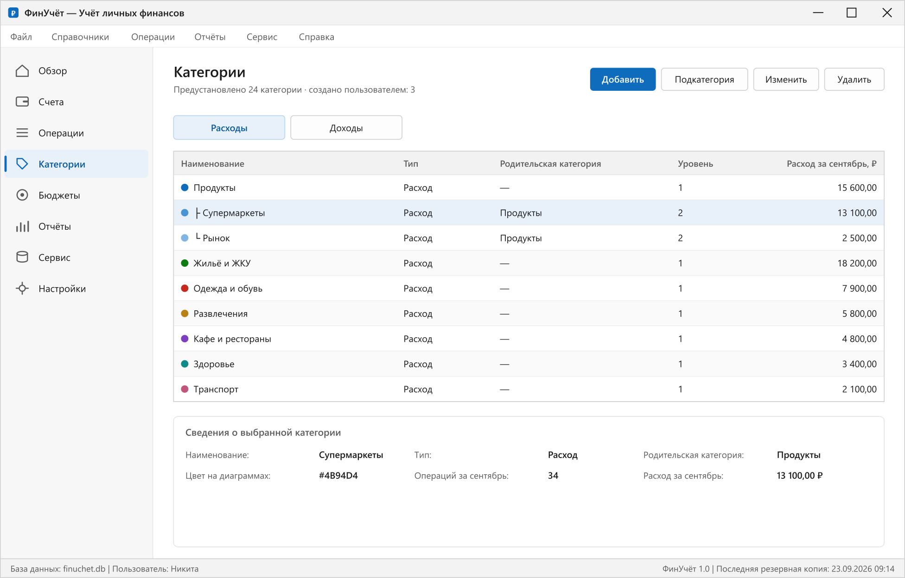
*Рисунок 7 — Раздел «Категории»*

Справочник двухуровневый: категория → подкатегория. Переключение между расходами и доходами —
кнопками над таблицей.

1. **«Добавить»** — категория первого уровня: наименование, тип («Доход»/«Расход»), цвет для диаграмм.
2. **«Подкатегория»** — создаётся для выбранной категории и наследует её тип.
3. **«Изменить»** — правка выбранной категории.
4. **«Удалить»** — блокируется, если категория используется в операциях или бюджетах.

Категории третьего уровня не предусмотрены.

### 3.6 Регистрация финансовых операций (ФТ-2)

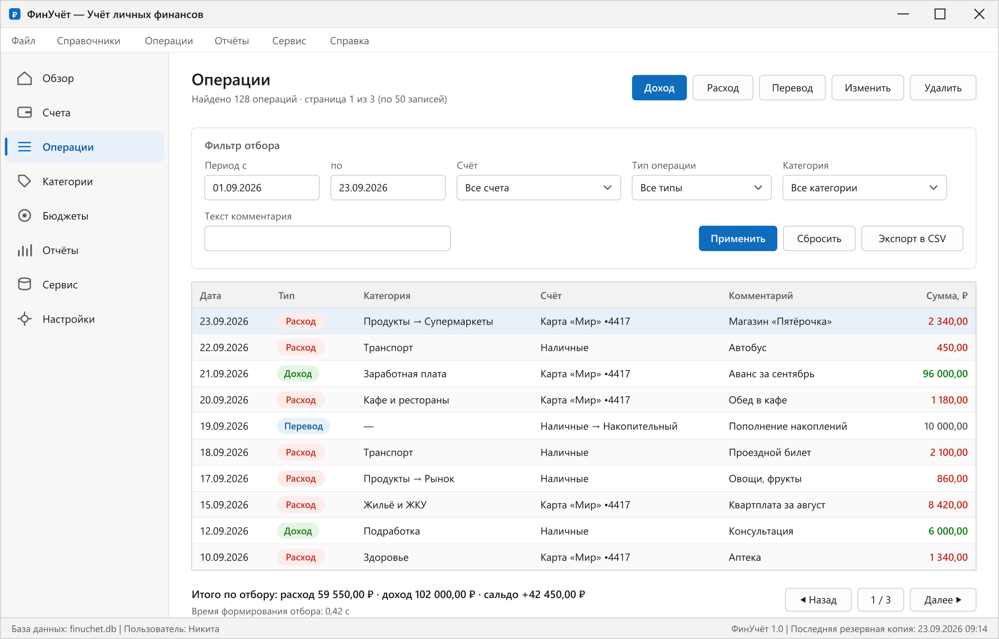
*Рисунок 8 — Раздел «Операции»*

#### 3.6.1 Доход и расход

1. Нажать **«Расход»** (или **«Доход»**) — открывается форма «Операция».
2. Заполнить поля формы.
3. Нажать **«Сохранить»** либо **«Сохранить и создать»** для ввода следующей операции.

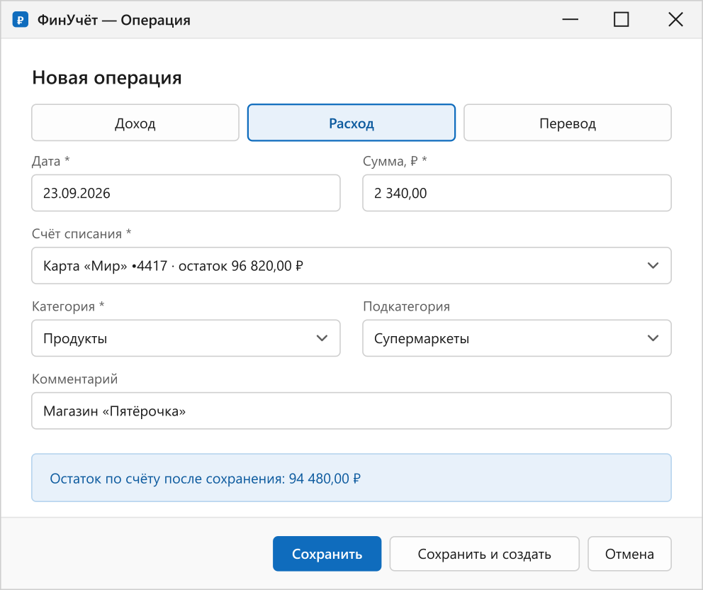
*Рисунок 9 — Форма «Операция», тип «Расход»*

| Поле | Обязательное | Правила заполнения |
|---|:--:|---|
| Тип операции | да | «Доход», «Расход» или «Перевод» |
| Дата | да | Не позже текущей даты |
| Сумма, ₽ | да | Строго больше нуля, два знака после запятой |
| Счёт | да | Счёт зачисления (доход) или списания (расход) |
| Счёт-источник / получатель | да (для перевода) | Счета не должны совпадать |
| Категория | да (доход, расход) | Из справочника соответствующего типа |
| Подкатегория | нет | Из подкатегорий выбранной категории |
| Комментарий | нет | До 255 символов |

#### 3.6.2 Перевод между счетами

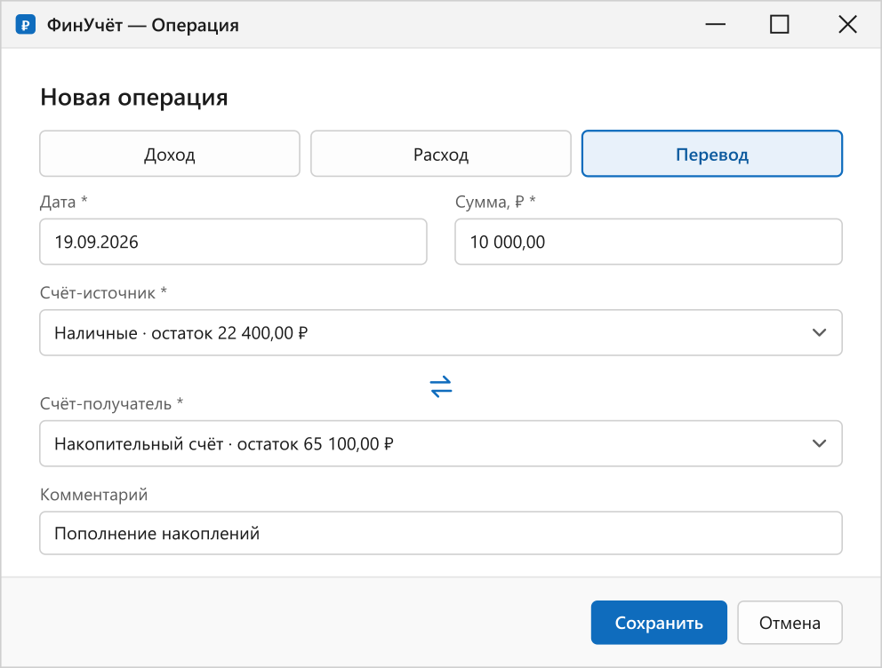
*Рисунок 10 — Форма «Операция», тип «Перевод»*

Категория для перевода не указывается. Перевод записывается **в одной транзакции**: остатки
обоих счетов изменяются одновременно, при ошибке транзакция полностью отменяется.

#### 3.6.3 Контроль вводимых данных

Поле, заполненное неверно, выделяется красной рамкой, под ним выводится пояснение,
операция не сохраняется:

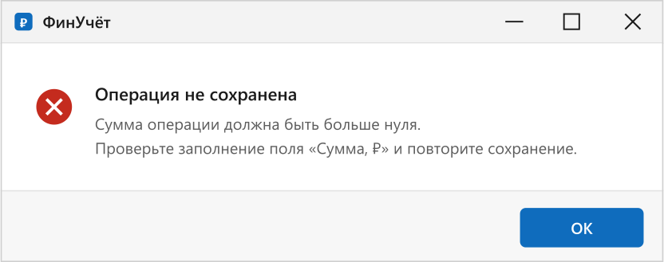
*Рисунок 11 — Сообщение о недопустимой сумме операции*

#### 3.6.4 Изменение и удаление операции

**«Изменить»** / **«Удалить»** — для выбранной строки. Остатки по счетам и показатели
исполнения бюджетов пересчитываются автоматически.

### 3.7 Поиск и фильтрация операций (ФТ-4)

Условия фильтра объединяются по правилу «И».

| Условие | Описание |
|---|---|
| Период с … по … | Дата начала не должна быть позже даты окончания |
| Счёт | Один счёт или все счета |
| Тип операции | «Доход», «Расход», «Перевод» или все типы |
| Категория | При выборе категории 1 уровня в отбор входят её подкатегории |
| Текст комментария | Вхождение подстроки, регистр не учитывается |

1. Задать условия отбора.
2. Нажать **«Применить»** — результат выводится постранично, по 50 записей.
3. Переход по страницам — кнопками **«Назад»** и **«Далее»**.
4. **«Сбросить»** — отмена всех условий.

Под таблицей выводятся итоги по отбору и время формирования результата: на базе
в 50 000 операций отбор занимает не более 2 с.

### 3.8 Планирование и контроль бюджетов (ФТ-5)

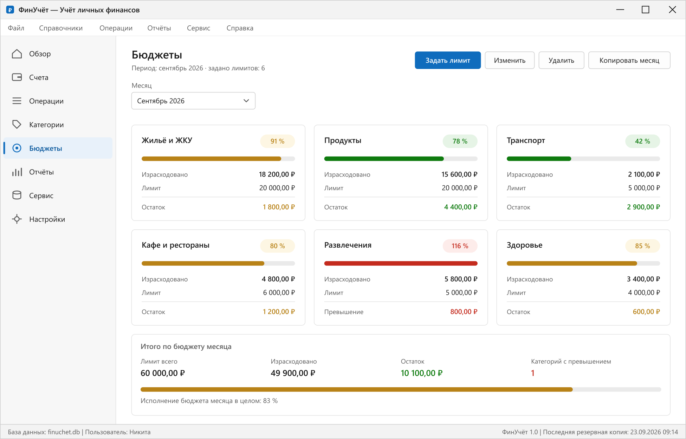
*Рисунок 12 — Раздел «Бюджеты»*

1. Выбрать месяц в поле **«Месяц»**.
2. Нажать **«Задать лимит»**, выбрать категорию расходов и указать сумму.
3. Нажать **«Сохранить»**.

| Исполнение лимита | Индикатор | Действия программы |
|---|:--:|---|
| менее 80 % | 🟢 зелёный | сообщения не выводятся |
| от 80 % до 100 % | 🟡 жёлтый | предупреждение о приближении к лимиту |
| более 100 % | 🔴 красный | предупреждение о превышении лимита |

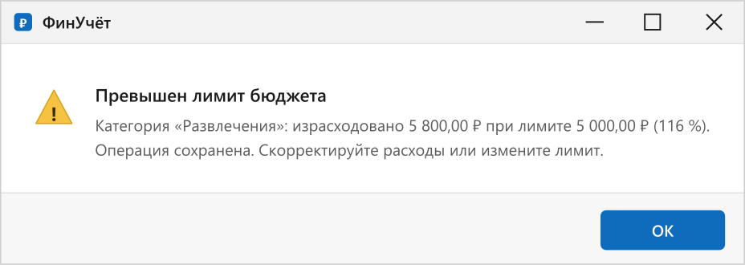
*Рисунок 13 — Предупреждение о превышении лимита бюджета*

Предупреждение информационное: операция сохраняется, решение принимает пользователь.
Кнопка **«Копировать месяц»** переносит набор лимитов на следующий месяц.

### 3.9 Формирование отчётов (ФТ-6)

1. Выбрать отчёт кнопкой в верхней части рабочей области.
2. Задать период и, при необходимости, счёт.
3. Нажать **«Сформировать»**; для печати — **«Печать»**.

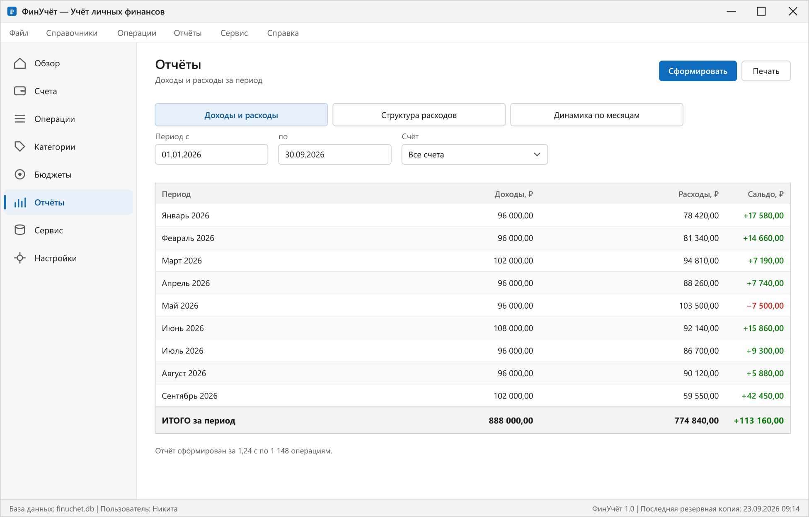
*Рисунок 14 — Отчёт «Доходы и расходы за период»*

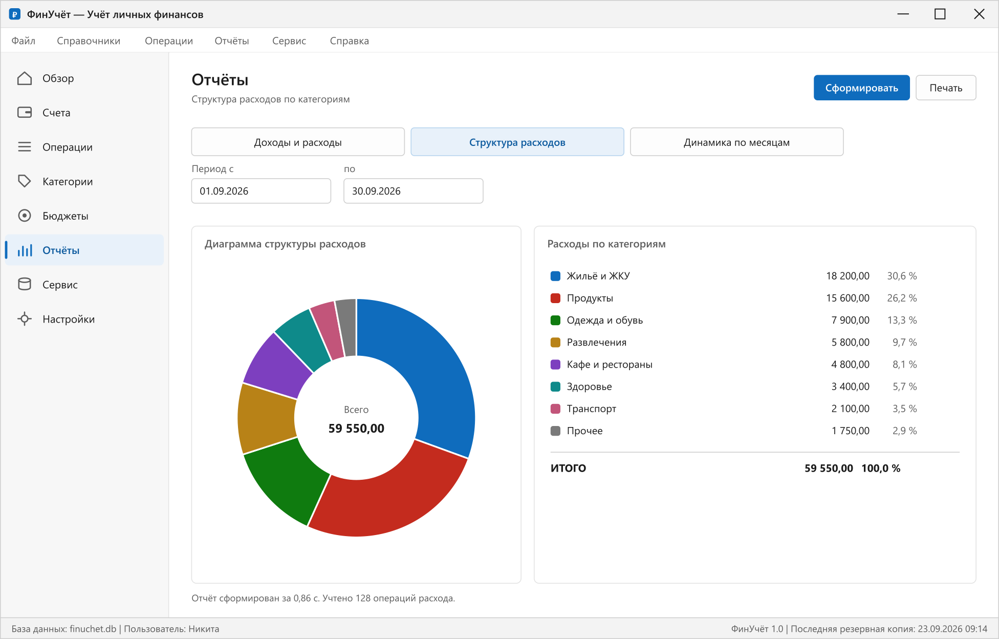
*Рисунок 15 — Отчёт «Структура расходов по категориям»*

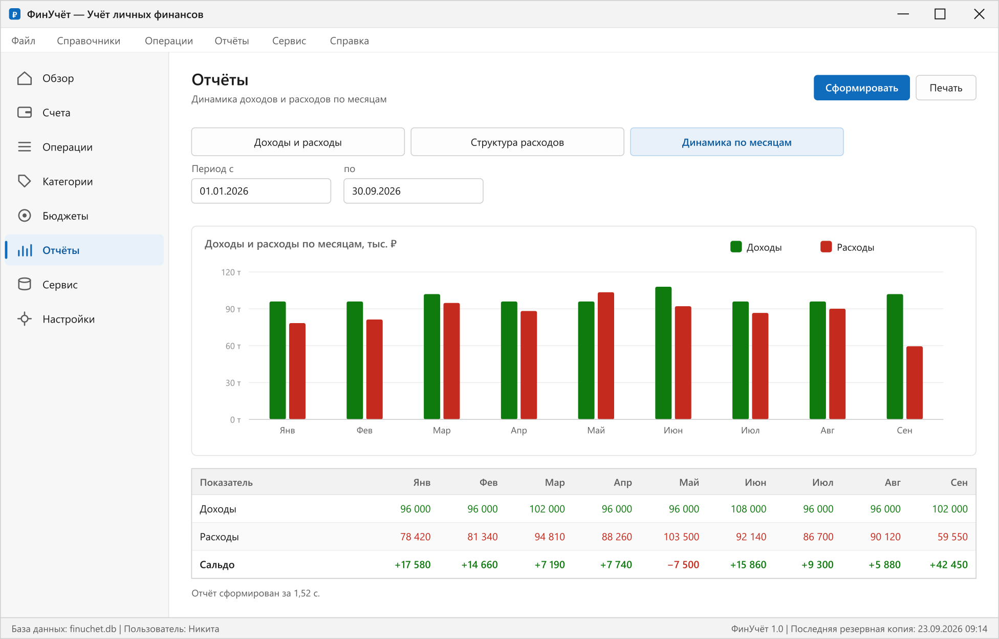
*Рисунок 16 — Отчёт «Динамика доходов и расходов по месяцам»*

Время формирования любого отчёта на базе в 50 000 операций не превышает 3 с.
Если за выбранный период данных нет, выводится информационное сообщение.

### 3.10 Экспорт и импорт данных (ФТ-7)

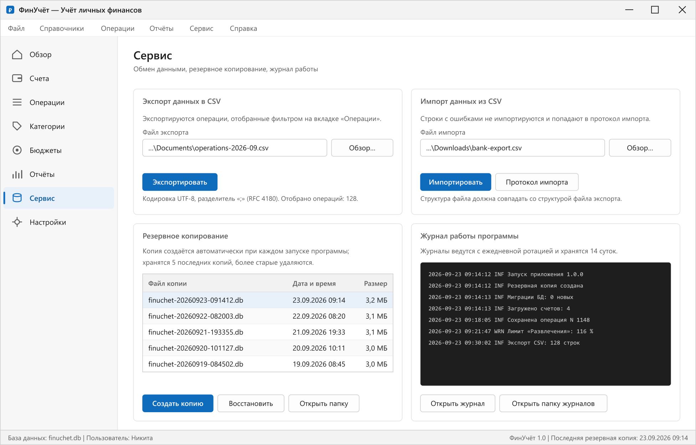
*Рисунок 17 — Раздел «Сервис»*

Формат обмена — CSV: кодировка UTF-8, разделитель «точка с запятой», структура по RFC 4180
(см. [приложение Б](#приложение-б-структура-файла-обмена-csv)).

#### Экспорт

1. В разделе «Операции» задать отбор и нажать **«Применить»**.
2. В разделе «Сервис» нажать **«Обзор…»** и указать файл.
3. Нажать **«Экспортировать»**.

#### Импорт

1. Нажать **«Обзор…»** и выбрать файл.
2. Нажать **«Импортировать»**.
3. Изучить протокол импорта.

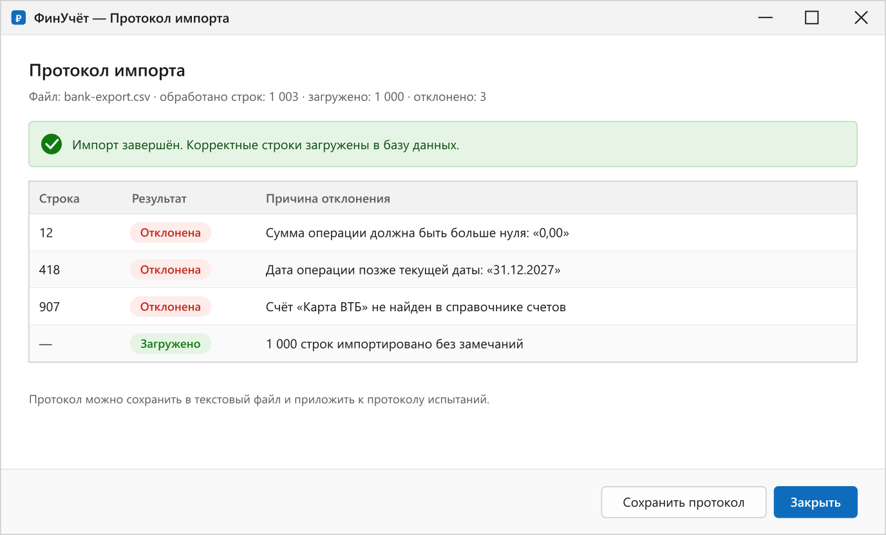
*Рисунок 18 — Окно «Протокол импорта»*

Строки с ошибками не импортируются; по каждой выводится номер строки и причина отклонения.
Корректные строки загружаются независимо от наличия ошибочных.

### 3.11 Резервное копирование и восстановление данных (ФТ-8)

Копия создаётся автоматически при каждом запуске; хранятся 5 последних копий.

- **«Создать копию»** — копия вручную в указанный файл (рекомендуется не реже раза в месяц на внешний носитель).
- **«Восстановить»** — восстановление из выбранной копии с подтверждением:

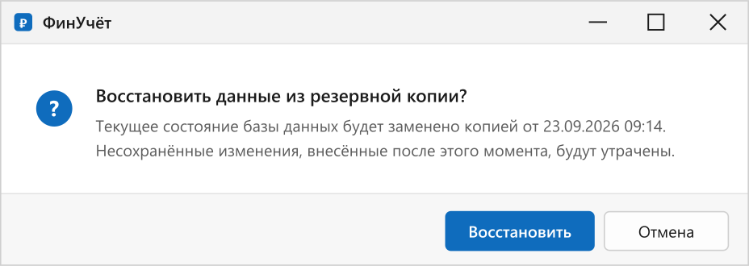
*Рисунок 19 — Запрос подтверждения восстановления данных*

> ⚠️ **Внимание!** При восстановлении текущее состояние базы данных полностью заменяется
> содержимым копии. Изменения, внесённые после её создания, будут утрачены.
> После восстановления программа перезапускается.

### 3.12 Настройка параметров программы (ФТ-10)

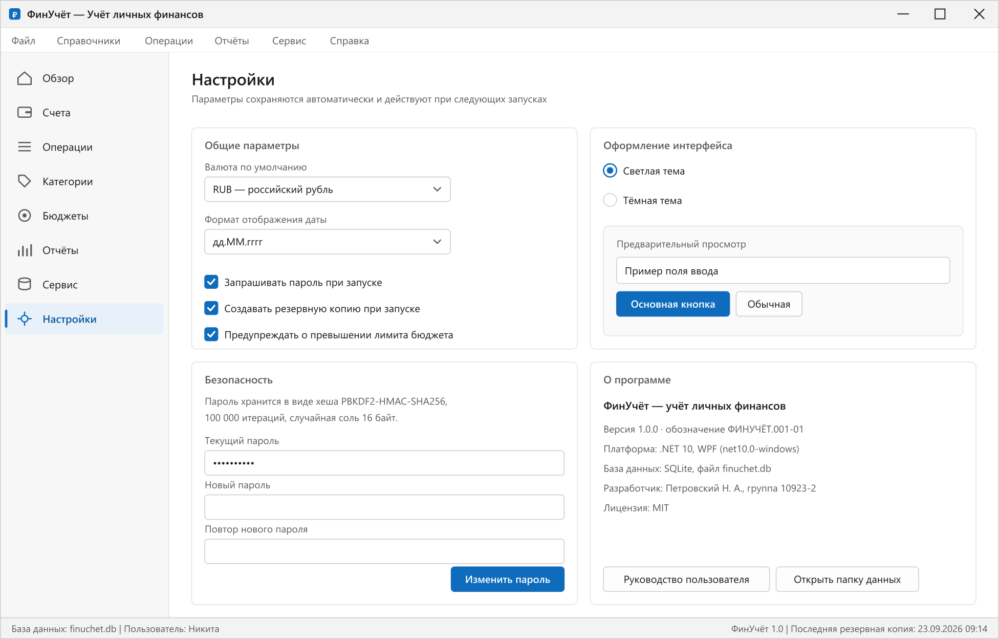
*Рисунок 20 — Раздел «Настройки»*

- **Общие параметры** — валюта по умолчанию, формат даты, режимы запуска.
- **Оформление интерфейса** — светлая или тёмная тема с предварительным просмотром.
- **Безопасность** — смена пароля: текущий пароль, новый пароль и его повтор.
- **О программе** — версия, платформа, файл базы данных, вызов руководства и каталога данных.

Заданные значения сохраняются автоматически и действуют при следующих запусках.

### 3.13 Завершение работы программы

- меню **«Файл» → «Выход»**;
- кнопка закрытия окна;
- сочетание клавиш `Alt+F4`.

Операции сохраняются в момент их регистрации, поэтому отдельного сохранения при выходе
не требуется. Если открыта форма с незавершённым вводом, программа запросит подтверждение.

---

## 4 Сообщения пользователю

### 4.1 Виды сообщений

| Вид | Значок | Смысл |
|---|:--:|---|
| Ошибка | 🔴 | Действие не выполнено, требуется исправление данных |
| Предупреждение | 🟡 | Действие выполнено, но требует внимания |
| Информационное | 🟢 | Действие выполнено успешно |
| Запрос подтверждения | 🔵 | Требуется решение пользователя |

Ошибки заполнения полей выводятся под полем ввода, поле выделяется красной рамкой.
При непредвиденной ошибке программа **не завершается аварийно**: работа продолжается,
технические сведения записываются в журнал.

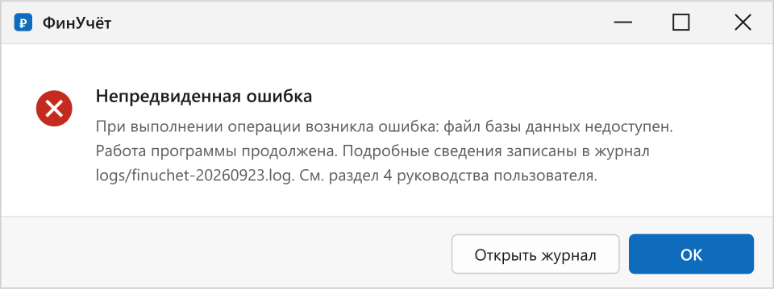
*Рисунок 21 — Сообщение о непредвиденной ошибке*

### 4.2 Перечень сообщений программы

| № | Текст сообщения | Причина | Действия пользователя |
|:--:|---|---|---|
| 1 | Пароль введён неверно. Осталось попыток: N | Введён неверный пароль | Повторить ввод пароля |
| 2 | Вход заблокирован. Повторите попытку через 60 с | Три неверные попытки входа | Подождать 60 с |
| 3 | Пароли не совпадают | Новый пароль и повтор различаются | Повторить ввод нового пароля |
| 4 | Текущий пароль указан неверно | Ошибка при смене пароля | Ввести действующий пароль |
| 5 | Наименование счёта не заполнено | Не заполнено обязательное поле | Ввести наименование (1…100 символов) |
| 6 | Счёт с таким наименованием уже существует | Нарушена уникальность | Указать другое наименование |
| 7 | Начальный остаток указан неверно | Значение не является числом | Ввести сумму в формате 0,00 |
| 8 | Удаление счёта невозможно. По счёту зарегистрировано N операций | Счёт используется в операциях | Удалить операции либо перевести счёт в архив |
| 9 | Сумма операции должна быть больше нуля | Нулевая или отрицательная сумма | Ввести сумму больше нуля |
| 10 | Дата операции не может быть позже текущей даты | Указана будущая дата | Указать дату не позднее текущей |
| 11 | Не выбрана категория операции | Не заполнено обязательное поле | Выбрать категорию |
| 12 | Счёт-источник и счёт-получатель не должны совпадать | При переводе выбран один счёт | Выбрать различные счета |
| 13 | Комментарий не должен превышать 255 символов | Превышена длина поля | Сократить комментарий |
| 14 | Категория с таким наименованием уже существует | Нарушена уникальность | Указать другое наименование |
| 15 | Удаление категории невозможно: категория используется в N операциях | Категория используется | Изменить категорию в операциях |
| 16 | Достигнуто 80 % лимита по категории «…» | Расходы приблизились к лимиту | Предупреждение; операция сохранена |
| 17 | Превышен лимит бюджета по категории «…» | Расходы превысили лимит | Предупреждение; скорректировать расходы или лимит |
| 18 | Лимит для категории «…» на выбранный месяц уже задан | Повторное задание лимита | Изменить существующий лимит |
| 19 | Дата начала периода позже даты окончания | Неверно задан период | Исправить даты периода |
| 20 | За выбранный период данные отсутствуют | Нет операций за период | Изменить период |
| 21 | Файл экспорта не может быть создан | Нет прав на запись в каталог | Выбрать другой каталог |
| 22 | Экспортировано строк: N | Экспорт завершён | Информационное сообщение |
| 23 | Файл импорта не найден или недоступен | Файл удалён, перемещён или занят | Указать существующий файл |
| 24 | Строка N не импортирована: <причина> | Строка не прошла проверку | Исправить строку и повторить импорт |
| 25 | Восстановить данные из резервной копии? | Запрос подтверждения | «Восстановить» либо «Отмена» |
| 26 | Резервная копия создана: <имя файла> | Копия создана | Информационное сообщение |
| 27 | Файл базы данных недоступен или повреждён | Файл удалён или повреждён | Восстановить из резервной копии (3.11) |
| 28 | Непредвиденная ошибка. Сведения записаны в журнал | Необработанное исключение | Продолжить работу; при повторении передать журнал разработчику |

### 4.3 Сообщения журнала работы

Журналы ведутся в каталоге `logs` с ежедневной ротацией, срок хранения — 14 суток.

| Уровень | Пример записи | Значение |
|---|---|---|
| `INF` | `Запуск приложения 1.0.0` | Штатное событие |
| `INF` | `Резервная копия создана` | Создана автоматическая копия БД |
| `INF` | `Миграции БД: 0 новых` | Проверена схема базы данных |
| `WRN` | `Лимит «Развлечения»: 116 %` | Превышение лимита бюджета |
| `ERR` | `Ошибка доступа к файлу базы данных` | Ошибка, о которой выведено сообщение |

При обращении к разработчику следует приложить файл журнала за день возникновения ошибки.

---

## Приложение А. Сочетания клавиш

| Сочетание | Действие |
|---|---|
| `Ctrl+N` | Создать операцию |
| `Ctrl+I` | Создать операцию «Доход» |
| `Ctrl+E` | Создать операцию «Расход» |
| `Ctrl+T` | Создать операцию «Перевод» |
| `Ctrl+F` | Перейти к фильтру отбора |
| `F5` | Обновить данные раздела |
| `Enter` | Сохранить данные формы |
| `Esc` | Закрыть форму без сохранения |
| `Delete` | Удалить выбранную запись |
| `Ctrl+S` | Создать резервную копию |
| `F1` | Открыть руководство пользователя |
| `Alt+F4` | Завершить работу программы |

## Приложение Б. Структура файла обмена CSV

Кодировка UTF-8, разделитель полей — `;`, разделитель строк — CRLF, оформление по RFC 4180.
Первая строка содержит заголовки колонок.

| № | Колонка | Тип | Описание | Пример |
|:--:|---|---|---|---|
| 1 | `date` | Дата | Дата операции, ИСО 8601 | `2026-09-23` |
| 2 | `type` | Строка | `income`, `expense`, `transfer` | `expense` |
| 3 | `amount` | Число | Сумма, два знака после запятой | `2340.00` |
| 4 | `account` | Строка | Счёт (для перевода — источник) | `Карта «Мир» •4417` |
| 5 | `account_to` | Строка | Счёт-получатель (только для перевода) | `Накопительный счёт` |
| 6 | `category` | Строка | Наименование категории | `Продукты` |
| 7 | `subcategory` | Строка | Наименование подкатегории | `Супермаркеты` |
| 8 | `comment` | Строка | Комментарий, до 255 символов | `Магазин «Пятёрочка»` |

```csv
date;type;amount;account;account_to;category;subcategory;comment
2026-09-23;expense;2340.00;Карта «Мир» •4417;;Продукты;Супермаркеты;Магазин «Пятёрочка»
2026-09-21;income;96000.00;Карта «Мир» •4417;;Заработная плата;;Аванс за сентябрь
2026-09-19;transfer;10000.00;Наличные;Накопительный счёт;;;Пополнение накоплений
```

---

## Связанные документы

- [Техническое задание ФИНУЧЁТ.001-01 ТЗ](../tz/FINUCHET.001-01-TZ.pdf)
- [Диаграммы проекта](../diagrams/README.md)
- [Указатель документации](../README.md)

[← В корень репозитория](../../README.md)
